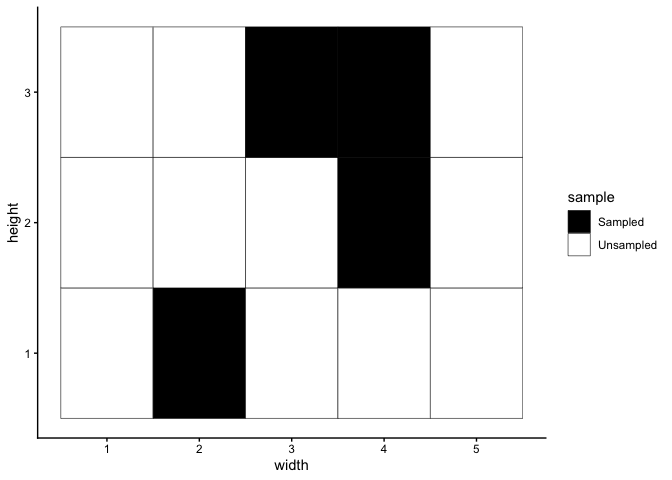

<!-- README.md is generated from README.Rmd. Please edit that file -->

# QuadratSampleGenerator

Function randomly selects the desired number of quadrats to be sampled
based on the given dimensions of the gridded study site, and plots a map
showing these quadrats. Input should not be a vector (integer value
only).

## Installation

Package installation can be done directly by calling

``` r
devtools::install_github("stat545ubc-2025/QuadratSampleGenerator")
```

## Example

This is a basic example which shows you how to use the package

``` r
library(QuadratSampleGenerator)
QuadratSampleGenerator(width = 5, height = 3, n_quadrats = 4)
```


